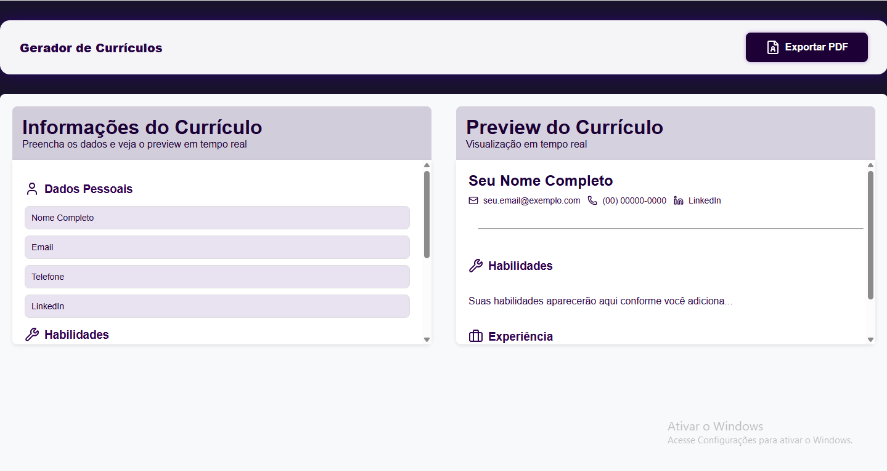

# Gerador de Currículo | Grupo Debbugers

> Gerador de Currículo é uma aplicação interativa e dinâmica, desenvolvida com React pelo Grupo Debuggers como parte do curso Desenvolve. Nossa ferramenta foi criada para simplificar a criação de currículos profissionais, oferecendo uma experiência de usuário fluida e intuitiva.

## ☕ Usando Gerador de Currículo | Grupo Debbugers

Para usar Gerador de Currículo | Grupo Debbugers, acesse:

https://gerador-de-curriculo-5zq5.vercel.app/

## ✨  Funcionalidades Principais Cadastro e edição de informações pessoais e experiências

Pré-visualização instantânea e opção de exportação do currículo em PDF

Totalmente responsivo: funciona no celular e computador

Interface intuitiva usando React para máxima performance

### 💻 Tecnologias Utilizadas

O projeto ainda está em desenvolvimento e as próximas atualizações serão voltadas para as seguintes tarefas:

- React | Interatividade e componentes
- JavaScript | Lógica e manipulação dinâmica
- HTML | Estrutura de páginas
- CSS3 | Estilos vibrantes e responsivos

